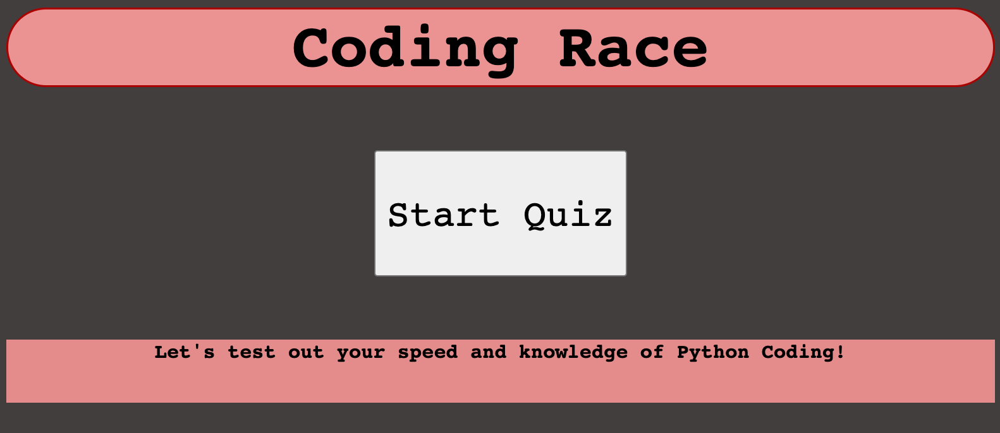
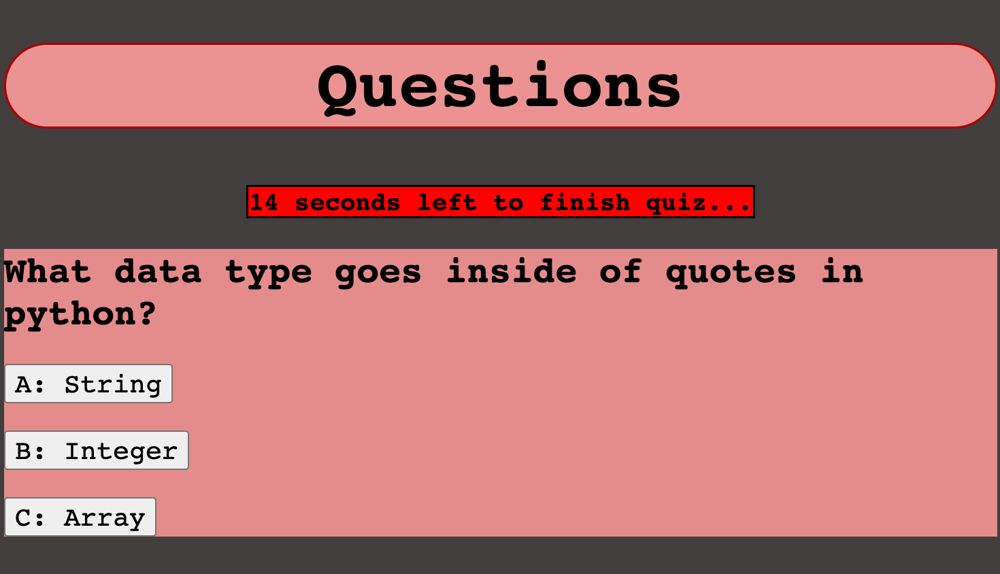

# portfolio

## Table of Contents 
1. [Description](#description)
2.  [Visuals](#visuals)
3. [Resources](#resources)

## Author:

Justin Stone

## Description

This webpage contains a timed coding quiz, that gives you a score based on how much time was left on the clock when you finish. Each question answered correctly will send you to the next question while each incorrect answer will prompt an alert and subtract 3 seconds off the time. At the end, the user has a chance to enter their initials for the highscore page.

## Visuals

## Resources
[LIVE SITE](https://justinstone2001.github.io/Code-Quiz/)

[Repository](https://github.com/Justinstone2001/Code-Quiz)
